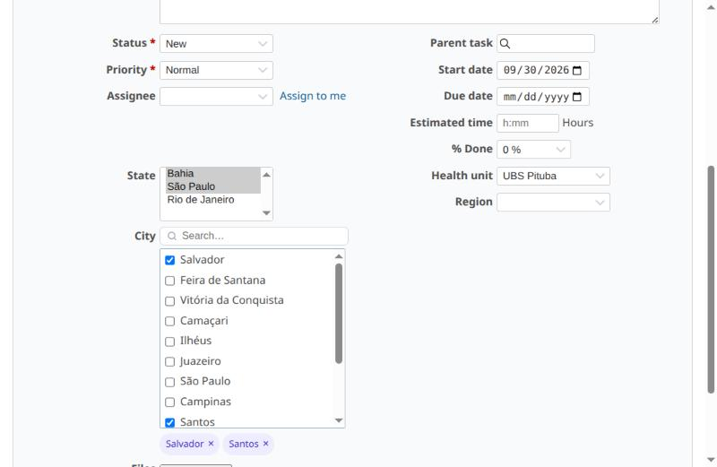
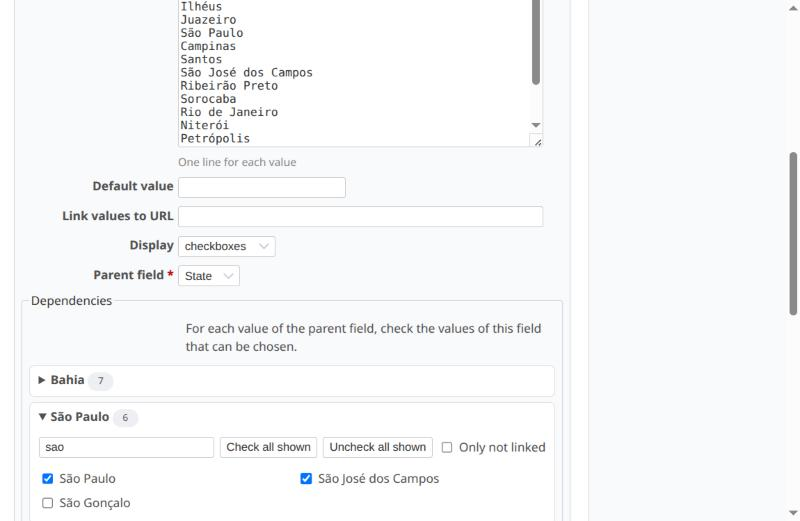

# Redmine Cascading Custom Fields

Este plugin adiciona o tipo de campo personalizado **"Lista (em cascata)"**: uma lista cujas opções dependem do(s) valor(es) escolhido(s) em um campo pai (ex.: *Macrorregião → Município → Unidade de saúde*).

[English](README.md)

## Novidades

* 0.2.0: opção para ocultar o campo enquanto a seleção do pai não oferecer opções.
* 0.1.0: primeira versão.

Veja o [CHANGELOG](CHANGELOG.md).

## Funcionalidades

* Novo tipo de campo **Lista (em cascata)**, com um **campo pai** (uma Lista ou outra Lista (em cascata) do mesmo tipo de objeto).
* Valor único ou múltiplos valores, exibidos como lista suspensa ou caixas de seleção, como qualquer lista do Redmine.
* **Vários valores no pai**: o campo filho oferece as opções de todos os valores marcados no pai.
* **Mantém as seleções ainda válidas**: quando o pai muda, só saem os valores do filho que deixaram de ser permitidos.
* **Cadeias** de qualquer tamanho (*Macrorregião → Município → Unidade*); ciclos são recusados.
* **Validação no servidor**: combinações inválidas são recusadas pela validação do próprio campo, que vale para qualquer gravação
  (testado: formulário e edição em massa; API REST e importação CSV passam pela mesma validação).
  Registros antigos com combinações antigas continuam editáveis enquanto os campos em cascata não forem alterados.
* **Ocultar quando não houver opções** (opcional, por campo): o campo some enquanto o pai estiver vazio ou enquanto
  os valores marcados no pai não tiverem valores vinculados, e deixa de ser obrigatório enquanto estiver oculto.
* **Editor de vínculo** na tela do campo: uma seção por valor do pai, com lista pesquisável,
  "marcar/desmarcar todos os exibidos", "só os sem vínculo" e contador de valores sem vínculo.
* Funciona no formulário da tarefa (inclusive nas recargas AJAX ao trocar tipo/situação) e na **edição em massa**.
* **Tarefa de migração** a partir do tipo "List (depending)" do Redmine Depending Custom Fields.
* Funciona junto com o [Redmine Searchable Custom Fields](https://github.com/cerqueirav/redmine_searchable_custom_fields) (busca nas listas longas).
* Sem migrações de banco (os dados ficam nas configurações padrão do campo), sem gems e sem bibliotecas JavaScript externas.
* Traduzido para 10 idiomas: inglês, português (Brasil), português (Portugal), espanhol, francês, italiano, alemão, russo, japonês e chinês (simplificado).

## Capturas de tela

### Formulário da tarefa
*State* (Lista) → *City* (Lista em cascata, caixas de seleção, com o Searchable Custom Fields) → *Health unit* (Lista em cascata).

### Editor de vínculo

## Versão do Redmine necessária

* 4.2.x ~ 6.1.x

Testado em instalações limpas (imagens Docker oficiais, SQLite): formulário da tarefa, edição em massa, criação/edição
do campo, validação no servidor e tarefa de migração.

| Redmine | Rails | Ruby |
|---|---|---|
| 6.1.4 | 7.2.3.2 | 3.4.11 |
| 6.0.11 | 7.2.3.2 | 3.3.12 |
| 6.0.5 | 7.2.2.1 | 3.3.8 (MySQL) |
| 5.1.12 | 6.1.7.10 | 3.2.11 |
| 5.0.12 | 6.1.7.10 | 3.1.7 |
| 4.2.10 | 5.2.8.1 | 2.7.8 |

## Instalação

1. Entre na pasta `plugins` do seu Redmine.
<pre>
git clone --branch v0.1.0 https://github.com/cerqueirav/redmine_cascading_custom_fields.git
</pre>
2. Reinicie o Redmine.

## Como usar

1. Crie o campo pai: *Administração → Campos personalizados → Novo campo*, tipo **Lista** (ex.: *Macrorregião*).
2. Crie o campo filho com o tipo **Lista (em cascata)**, preencha os valores possíveis e escolha o **Campo pai**.
3. Em **Vínculo**, abra cada valor do pai e marque os valores do filho que ele permite. Salve.
4. Opcional: marque **Ocultar quando não houver opções** para ocultar o campo enquanto a seleção do pai não oferecer valores.

## Migrando do Redmine Depending Custom Fields

Converte todos os campos "List (depending)" em "Lista (em cascata)", mantendo o campo pai, o vínculo e os valores já
salvos nas tarefas. Faça backup do banco antes.

<pre>
bundle exec rake redmine:cascading_custom_fields:migrate_from_depending RAILS_ENV=production DRY_RUN=1   # simulação
bundle exec rake redmine:cascading_custom_fields:migrate_from_depending RAILS_ENV=production
</pre>

Depois é possível desinstalar o Depending Custom Fields (`bundle exec rake redmine:plugins:migrate NAME=redmine_depending_custom_fields VERSION=0 RAILS_ENV=production`,
apagar a pasta dele e reiniciar o Redmine).

## Desinstalação

1. Apague ou converta antes os campos "Lista (em cascata)" (um campo cujo tipo não está instalado não pode ser usado).
2. Apague a pasta `plugins/redmine_cascading_custom_fields`.
3. Reinicie o Redmine.

## Autor

Victor Cerqueira — dev.cerqueirav@gmail.com

## Licença

GNU General Public License v3.0 ou posterior. Veja [LICENSE](LICENSE).

Se você modificar e distribuir este plugin, mantenha os avisos de copyright, indique suas alterações e
distribua a sua versão sob a mesma licença.
